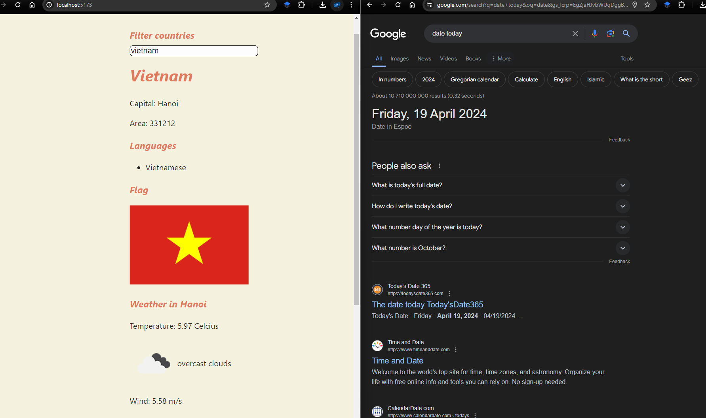

# 🌍 Country App (React + Vite)

This project is built with **React + Vite** and uses the [OpenWeatherMap API](https://openweathermap.org) to fetch weather data.  
To run it locally, you’ll need an API key from OpenWeatherMap.

---

## 🔑 Getting an API Key
1. Create a free account at [OpenWeatherMap](https://openweathermap.org).
2. Go to [My API Keys](https://home.openweathermap.org/api_keys).
3. Copy one of your active keys.  
   > ⏳ Note: A newly generated API key may take a few minutes to become active.

---

## ⚙️ Running Locally

1. Open the integrated terminal in the project folder:  
   `part2.18_2.20`
2. Install dependencies:
   ```bash
   npm install
   npm install axios
   npm install json-server --save-dev
   ```
3. Start the mock server:
   ```bash
   npm run server
   ```
4. Open another terminal (split or new) in the same folder.

---

## 🌐 Setting the API Key

You can provide your API key via an **environment variable** or a `.env` file.

### Option 1: Environment Variable
Replace `YOUR_API_KEY_HERE` with your actual key:

**Linux/macOS (Bash):**
```bash
export VITE_SOME_KEY=YOUR_API_KEY_HERE && npm run dev
```

**Windows (PowerShell):**
```powershell
($env:VITE_SOME_KEY="YOUR_API_KEY_HERE") -and (npm run dev)
```

**Windows (cmd.exe):**
```cmd
set "VITE_SOME_KEY=YOUR_API_KEY_HERE" && npm run dev
```

### Option 2: `.env` File
Create a `.env` file in the project root and add:
```
VITE_SOME_KEY=YOUR_API_KEY_HERE
```

Then simply run:
```bash
npm run dev
```

---

## 🚀 Usage
Once the app is running, open your browser and go to:  
👉 [http://localhost:5173](http://localhost:5173) (or the port shown in your terminal)

---

## 🎥 Demo
Result preview:


[](./public/countryglance.mp4)
